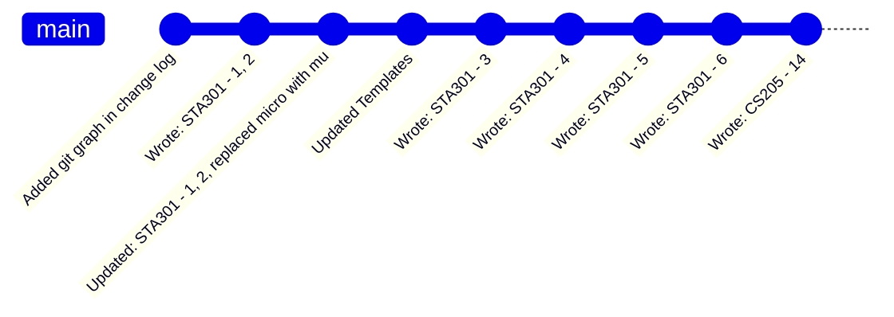

# Change Log

```mermaid
gitGraph
	commit id: "Added git graph in change log"
	commit id: "Wrote: STA301 - 1, 2"
	commit id: "Updated: STA301 - 1, 2, replaced \micro with \mu"
	commit id: "Updated Templates"
	commit id: "Wrote: STA301 - 3"
	commit id: "Wrote: STA301 - 4"
	commit id: "Wrote: STA301 - 5"
	commit id: "Wrote: STA301 - 6"
	commit id: "Wrote: CS205 - 14"
```
