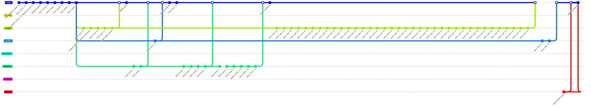

# Change Log

```mermaid
gitGraph
	commit id: "Added git graph in change log"
	commit id: "Wrote: STA301 - 1, 2"
	commit id: "Updated: STA301 - 1, 2, replaced \micro with \mu"
	commit id: "Updated Templates"
	commit id: "Wrote: STA301 - 3"
	commit id: "Wrote: STA301 - 4"
	commit id: "Wrote: STA301 - 5"
	commit id: "Wrote: STA301 - 6"
	commit id: "Wrote: CS205 - 14"
	branch cs402
	branch cs205
	branch cs502
	branch mcm301
	branch mth401
	branch sta301
	checkout cs205
	commit id: "Wrote: cs205 - 15"
	commit id: "Updated: cs205 - 15, added post assessments"
	commit id: "Wrote: cs205 - 16"
	commit id: "Wrote: cs205 - 17"
	commit id: "Added: mth401 lectures"
	checkout main
	merge cs205
	commit id: "Merged cs205"
	checkout mth401
	commit id: "Wrote: mth401 - 1"
	commit id: "Wrote: mth401 - 2"
	checkout main
	merge mth401
	checkout cs502
	commit id: "Wrote: cs502 - C1"
	checkout main
	merge cs502
	commit id: "Updated change log"
	commit id: "Wrote: cs502 - C2"
	checkout mth401
	commit id: "Wrote: mth401 - 3"
	commit id: "Wrote: mth401 - 4"
	commit id: "Wrote: mth401 - 5"
	commit id: "Wrote: mth401 - 6"
	checkout main
	merge mth401
	checkout mth401
	commit id: "Wrote: mth401 - 7"
	commit id: "Wrote: mth401 - 8"
	commit id: "Wrote: mth401 - 8"
	commit id: "Wrote: mth401 - 9"
	commit id: "Updated: mth401 - 8, 9"
	commit id: "Wrote: mth401 - 10"
	commit id: "Wrote: mth401 - 11"
	checkout main
	merge mth401
	commit id: "Updated: Change log"
	checkout cs205
	commit id: "Wrote: cs205 - 18"
	commit id: "Wrote: cs205 - 19"
	commit id: "Wrote: cs205 - 20"
	commit id: "Wrote: cs205 - 21"
	commit id: "Wrote: cs205 - 22"
	commit id: "Wrote: cs205 - 23"
	commit id: "Wrote: cs205 - 24"
	commit id: "Wrote: cs205 - 25"
	commit id: "Wrote: cs205 - 26"
	commit id: "Wrote: cs205 - 27"
	commit id: "Wrote: cs205 - 28"
	commit id: "Wrote: cs205 - 29"
	commit id: "Wrote: cs205 - 30"
	commit id: "Wrote: cs205 - 31"
	commit id: "Wrote: cs205 - 32"
	commit id: "Wrote: cs205 - 33"
	commit id: "Wrote: cs205 - 34"
	commit id: "Wrote: cs205 - 35"
	commit id: "Wrote: cs205 - 36"
	commit id: "Wrote: cs205 - 37"
	commit id: "Wrote: cs205 - 38"
	commit id: "Wrote: cs205 - 39"
	commit id: "Wrote: cs205 - 40"
	commit id: "Wrote: cs205 - 41"
	commit id: "Wrote: cs205 - 42"
	commit id: "Wrote: cs205 - 43"
	commit id: "Wrote: cs205 - 44"
	commit id: "Wrote: cs205 - 45"
	commit id: "Wrote: cs205 - 46"
	commit id: "Wrote: cs205 - 47"
	commit id: "Wrote: cs205 - 48"
	commit id: "Wrote: cs205 - 49"
	commit id: "Wrote: cs205 - 50"
	commit id: "Wrote: cs205 - 51"
	commit id: "Wrote: cs205 - 52"
	commit id: "Wrote: cs205 - 53"
	checkout main
	merge cs205
	commit id: "Updated: Change Log"
	checkout cs502
	commit id: "Wrote: cs502 - C3"
	commit id: "Wrote: cs502 - C4"
	checkout main
	merge cs502
	commit id: "Updated: Change Log"
	branch graph
	checkout graph
	commit id: "Added Obsidian_graph"
	checkout main
	merge graph
	commit id: "Updated: Change Log"
```
