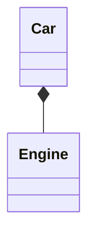
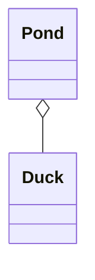
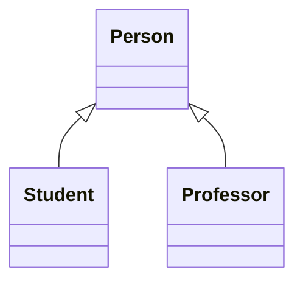

# Class Diagram

Describes system's `classes`, attributes, behaviors and relationships.

## Visibility

Determines which attributes and behaviors are visible outside of the class.

- `+` for `public`
- `-` for `private`
- `#` for `protected`

## Relationships

### Composition

Also known as `composite aggregation`, is a relationship where the lifecycle of the _composing object_ is dependent on the lifecycle of _composed objects_.  
In other words, If the composed object is destroyed, then its components are also destroyed.

### Aggregation

In this relationship, the lifecycles of both, composed and composing objects is independent of each other.

### Inheritance

If two or more `classes` possess some amount of attributes or behaviors as common, we can abstract them away into a container called

- `Parent class`
- `Base class`
- `Super class`

The `classes` possessing those attributes and behaviors, are called

- `Child class`
- `Derived class`
- `Sub class`

## References

Read about [class diagram](https://en.wikipedia.org/wiki/Class_diagram).