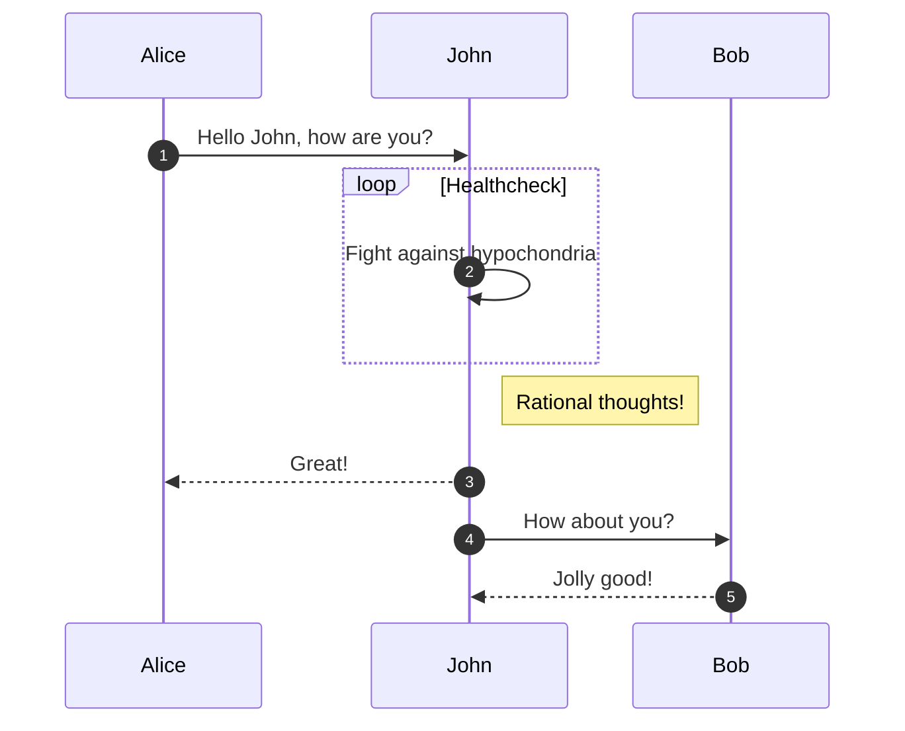
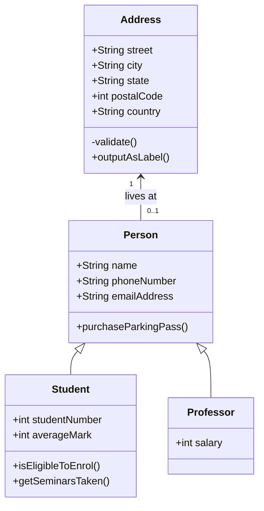
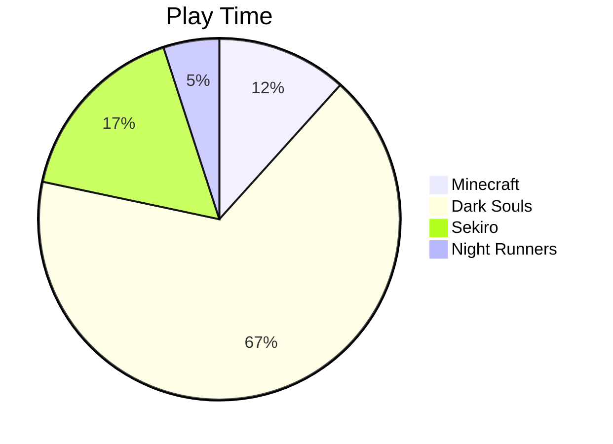

# Feature Showcase

This page show cases the features of this website.

## Normal Obsidian Callouts

> [!note]- A note  
> Hello

> [!tip]- A tip  
> Hello

> [!abstract]- A abstract  
> Hi

> [!info]- A info  
> Hi

> [!todo]- A todo  
> Hi

> [!tip]- A tip  
> Hi

> [!success]- A success  
> Hi

> [!question]- A question  
> Hi

> [!warning]- A warning  
> Hi

> [!failure]- A failure  
> Hi

> [!danger]- A danger  
> Hi

> [!bug]- A bug  
> Hi

> [!example]- A example  
> Hi

> [!quote]- A quote  
> Hi

## Syntax Highlighting

### Inline

`#!cpp std::cout<< "Hello World!" << std::endl;`

### Block

```{.cpp .copy}
#include <iostream>

int main () {
    std::cout << "Hello World" << std::endl;
    return 0;
}
```

## Line Highlight

```cpp hl_lines="4-5"
#include <iostream>

int main () {
    std::cout << "Hello World" << std::endl;
    return 0;
}
```

## Tabbed Content Blocks

=== "Tab 1 - Python"  
    ```python  
    print("Hello World!")  
    ```

=== "Tab 2 - JavaScript"  
    ```js  
    console.log("Hello World");  
    ```

## Super Fences

### Not close - Able

!!! note "non close able"  
    > [!note]- A note  
    > hello


    > [!tip]- A tip
    > hello

### Close - Able

??? warning "3 notifications"  
    > [!note]- A note  
    > ```cpp  
    > #include <iostream>  
    > int main () {  
    >   return 0;  
    > }  
    > ```

    > [!note]- A note
    > ```python
    > print("Hello World")
    > ```

    > [!danger]- A danger
    > === "Tab 1"
    >       Following `python script` does these tasks
    >   
    >       1. Run
    >       2. close
    >
    >       ```py
    >       print("hello")
    >       ```
    >
    > === "Tab 2"
    >       Following `JS` code does stuff
    >
    >       1. run
    >       2. close
    >
    >       ```js
    >       console.log("hello")
    >       ```
    

## Buttons

[Send Message :fontawesome-regular-paper-plane:](#){.md-button}  
[Go to root](#){.md-button .md-button--primary}

## Code Annotation

```{.cpp .annotate .copy}
#include <iostream>

int main () {
    std::cout << "Hello World" << std::endl; // (1)!
    return 0;
}
```

1. The following object, i.e. `cout` comes from the `std` namespace.

## Tables

| Method | Visibility |
| ------ | ---------- |
| `jump()` | :material-check: Yes|
| `calculate_distance()` | :material-close: No |

## Mermaid Diagrams

### Sequence Diagram



### Class Diagram



### Pie



## Footnotes

Hello World [^1]

## Formatting

- {--deleted--}
- {++added++}
- ==highlighted==

## Images with Captions


/// caption  
Placidusax  
///

## Custom Lists

### Unordered List

- Bullet 1
- Bullet 2

### Order Listed

1. One
2. Two

### Task List

- [ ] Task 1
- [x] Task 2
- [ ] Task 3

[^1]: This is a footnote