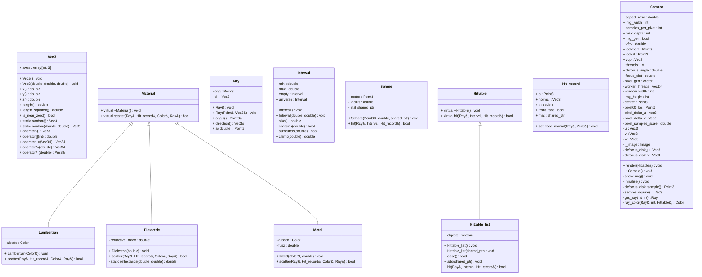

# Main

## Class Diagram

Our first task is to have a way to display whatever the heck we are trying to display.  
For that, I am using [SFML](https://github.com/SFML/SFML).

A `ray tracer` is responsible for following tasks.

1. Shooting rays out of the eye.
2. Determining which objects are being hit by that ray at closest.
3. Determine the color of pixel to show on screen.

Now we need to know what a `ray`[^1] is.  
Checkout `aspect ratio` variable in [[Camera|camera]].  
Using this, we will determine dimensions of the following

1. `Image`
2. `Viewport` (a virtual 2D rectangle in the space which shows the image)
3. `Window`

Selecting an arbitrary `height` _or_ `width` for any of these, we can find the other.  

$$\frac {\text{width}}{\text{height}} = \text{aspect ratio}$$

To start off, we will try drawing a _sky_ which is going to be just a gradient from `blue` to `white`.  
For that, we will use a `lerp function`.  
This will _smoothly_ transition from `blue` to `white`.

> [!NOTE] `blue` and `white` both are `colors`[^2] consisting of $r$, $g$ and $b$ values.  

Read about `camera::ray_color` in [[Camera|camera]].

## References

[^1]: Read more about [[notes_publisher/docs/Projects/rayTracing/Ray|ray]] in context of this project.
[^2]: Read more about [[Vec3|colors]].