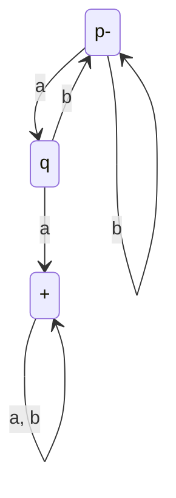
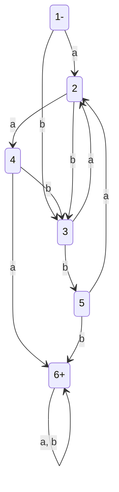
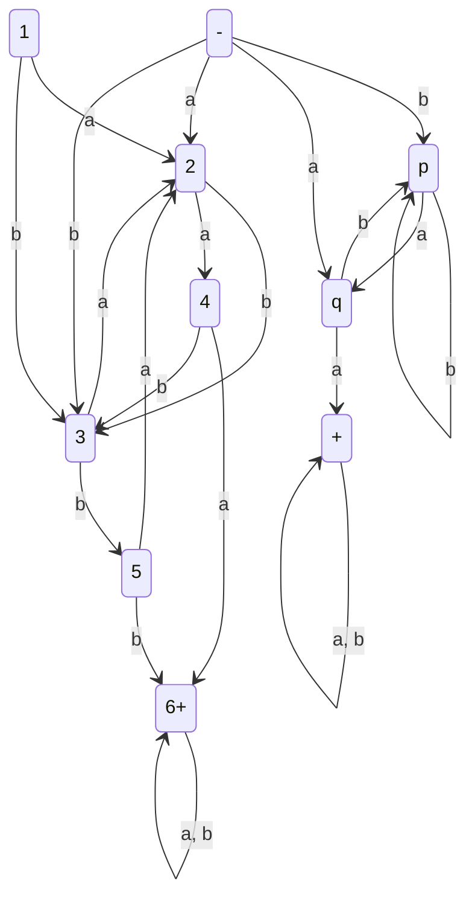
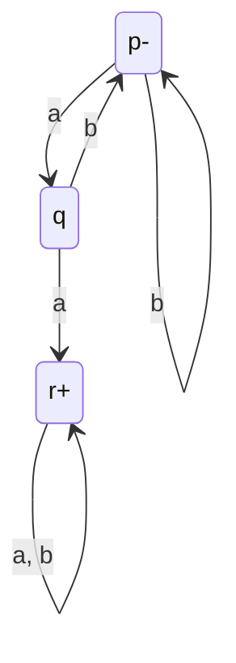
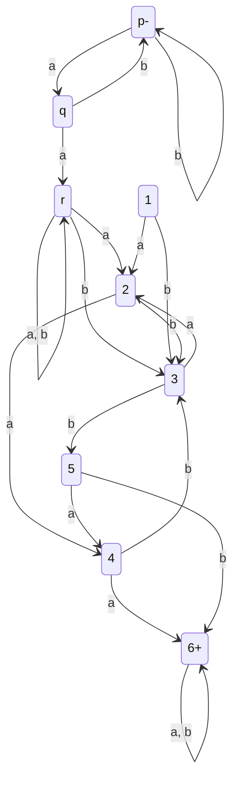
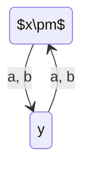
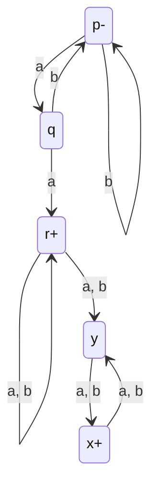
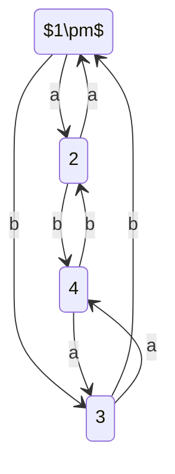
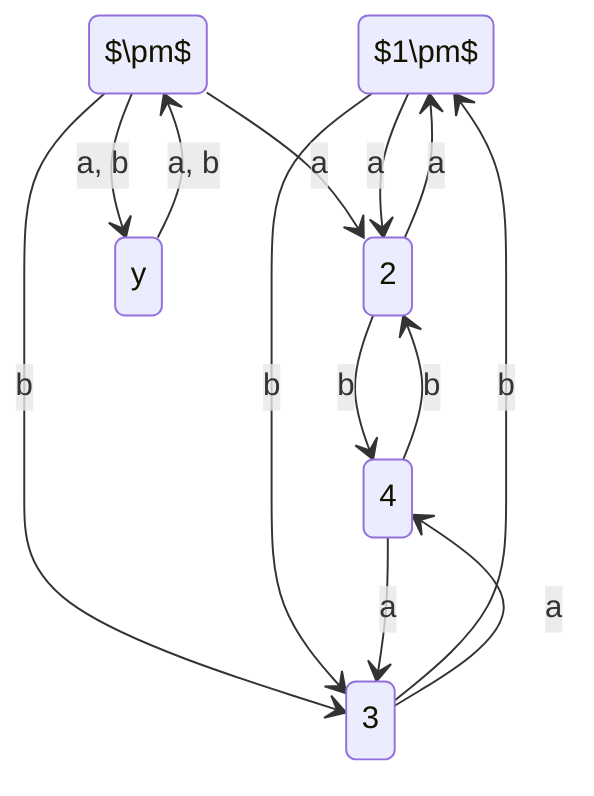

---
tags:
  - university-notes
university-name: Virtual University of Pakistan
date: 2024-11-02
---

Dated: 02-11-2024

# Lecture No. 18

## Example

### $FA_1$

### $FA_2$

#### `Non Deterministic Finite Automaton`[^1] For $FA_1 \cup FA_2$

## `Non Deterministic Finite Automaton`[^1] For $FA_1 FA_2$

### Method

From the first `finite automaton`,[^2] introduce new `states` which connect the `final states` to 2nd `finite automaton`'s[^2] `states` which are connect to its own(the 2nd `finite automaton`[^2]) `initial states`.

There are some possible routes we can take depending on if the `finite automata`[^2] accept a `null string`[^3] or not

#### $FA_1$ And $FA_2$ Does not Accept $\Lambda$

##### $FA_1$

##### $FA_2$

##### `Non Deterministic Finite Automaton`[^1] For $FA_1 FA_2$

#### $FA_2$ Accepts $\Lambda$ but $FA_1$ Does not

##### $FA_1$

##### $FA_2$

##### `Non Deterministic Finite Automaton`[^1] For $FA_1 FA_2$

#### Both $FA_1$ and $FA_2$ Accept $\Lambda$

##### $FA_1$

##### $FA_2$

##### `Non Deterministic Finite Automaton`[^1] For $FA_1 FA_2$

## `Non Deterministic Finite Automaton`[^1] For $FA^*$

### Method

The method is rather confusing to be stated in one paragraph so I will define it step by step with an example visualization.

#### Example

Consider the following `finite automaton`[^2]  
![[cs402_18_d_1.svg]]  
Because the $FA^*$ can accept a $\Lambda$, therefore we will introduce a `state` which is both, `initial` and `final`.  
![[cs402_18_d_2.svg]]  
Then we will connect it to the `states` which are connected to old `initial state` through the same transitions.  
![[cs402_18_d_3.svg]]  
In similar fashion, we will connect the old `final state` as well and remove the $-$ sign for old `initial state`.  
![[cs402_18_d_4.svg]]

## References

[^1]: Read more about [[semester 5/CS402 - Theory of Automata/Lecture no. 15/Lecture|non deterministic finite automaton]].
[^2]: Read more about [[notes_publisher/docs/University Notes/semester 5/CS402 - Theory of Automata/Lecture no. 4/Lecture|finite automaton]].
[^3]: Read more about [[notes_publisher/docs/University Notes/semester 5/CS402 - Theory of Automata/Lecture no. 1/Lecture|strings]].