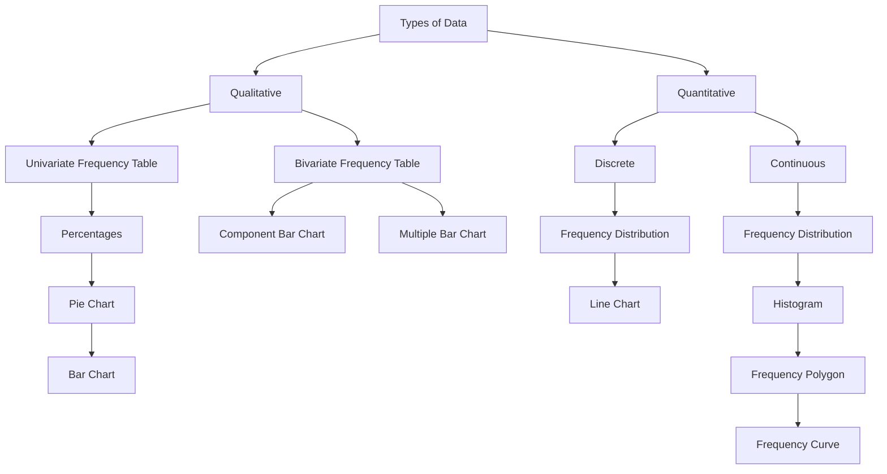

---
tags:
  - university-notes
university-name: 
date: 2024-11-05
---

Dated: 05-11-2024

# Lecture No. 3

```mermaid
graph TD
    A[Types of Data]
    A --> B[Qualitative]
    A --> C[Quantitative]
    
    B --> D[Univariate Frequency Table]
    B --> E[Bivariate Frequency Table]
    D --> F[Percentages]
    F --> G[Pie Chart]
    G --> H[Bar Chart]
    E --> I[Component Bar Chart]
    E --> J[Multiple Bar Chart]
    
    C --> K[Discrete]
    C --> L[Continuous]
    K --> M[Frequency Distribution]
    M --> N[Line Chart]
    
    L --> O[Frequency Distribution]
    O --> P[Histogram]
    P --> Q[Frequency Polygon]
    Q --> R[Frequency Curve]
```

