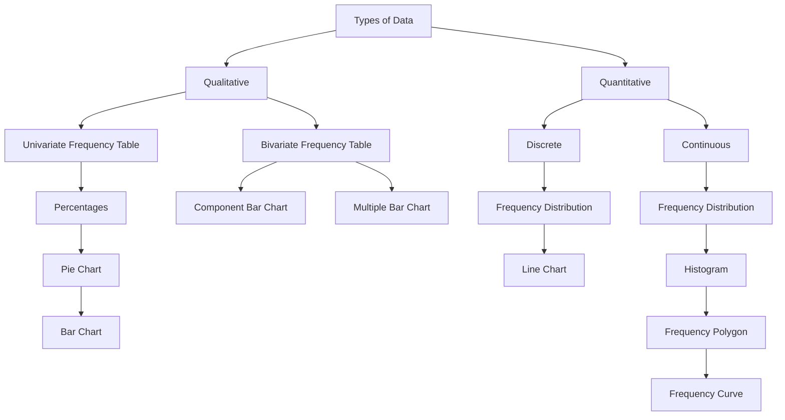
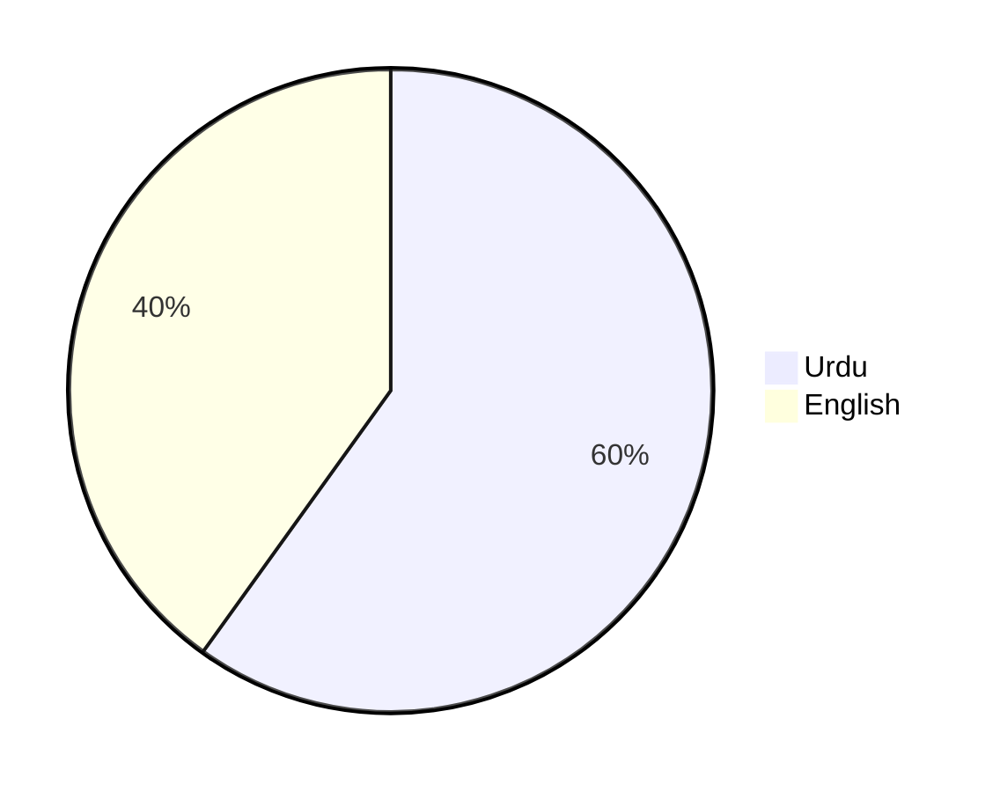
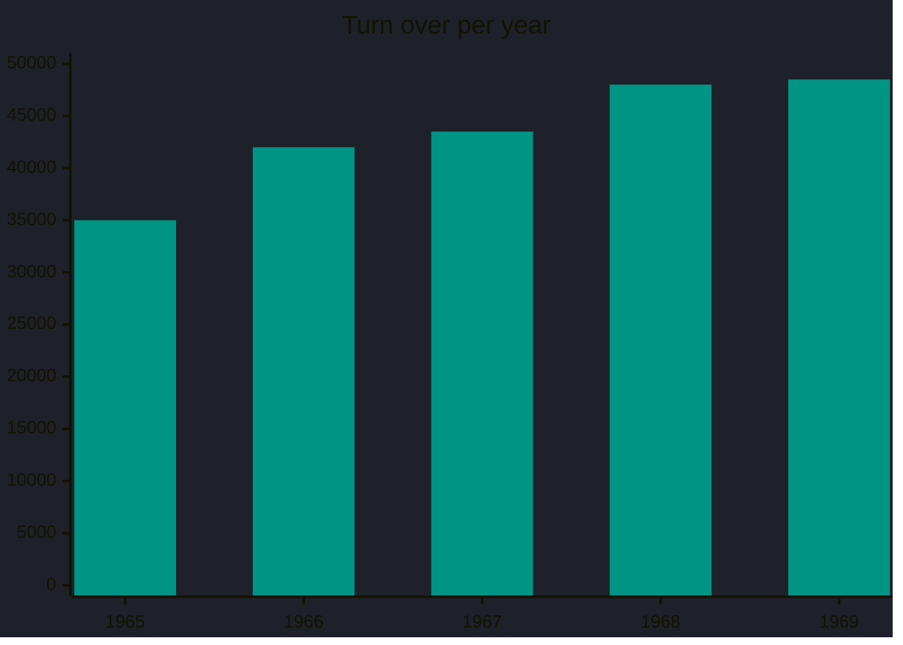

---
tags:
  - university-notes
university-name: 
date: 2024-11-05
---

Dated: 05-11-2024

# Lecture No. 3

## Example

In a survey of 1200 first-year students in a co-ed college in Lahore, we aim to find the proportion from Urdu and English medium schools.  
Interviews will gather data, resulting in an array of observations.

We will have an array of observations as follows:  
U, U, E, U, E, E, E, U, …  
Here `U` is for `Urdu` and `E` is for `English`.

| Medium of institution | No. of Students(f) | % = $\frac f t \times 100$ |
| --------------------- | ------------------ | -------------------------- |
| Urdu                  | 719                | 59.9% = 60%                |
| English               | 481                | 40.1% = 40%                |
|                       | 1200 (t)           |                            |

### Pie Chart

We created a univariate frequency table for qualitative data.  
This can be represented using a pie chart, where the circle is divided into sectors based on the categories (Urdu and English medium schools).  
To determine the angle for each sector,  

$$\frac{\text{cell frequency}}{\text{Total Frequency}} \times 360^\circ$$

| Medium of institution | No. of Students(f) | $\theta = \frac f t \times 360$ |
| --------------------- | ------------------ | ------------------------------- |
| Urdu                  | 719                | $215.7^\circ$                   |
| English               | 481                | $144.3^\circ$                   |
|                       | 1200 (t)           |                                 |

### Simple bar Chart

A simple bar chart uses horizontal or vertical bars of equal width, with lengths proportional to the values they represent.  
The bar widths hold no mathematical significance but enhance visual appeal.  
Let's consider an example.

| Years             | 1965   | 1966   | 1967   | 1968   | 1969   |
| ----------------- | ------ | ------ | ------ | ------ | ------ |
| Turnover (Rupees) | 35,000 | 42,000 | 43,500 | 48,000 | 48,500 |

Previously, we examined univariate situations, focusing on a single variable like ‘medium of schooling’ or ‘turnover.’  
Now, let’s consider a bivariate situation.  
For instance, in the first-year students’ survey, we could record both the medium of schooling and the student's sex.

| Student No. | Medium | Gender |
| ----------- | ------ | ------ |
| 1           | U      | F      |
| 2           | U      | M      |
| 3           | E      | M      |
| 4           | U      | F      |
| 5           | E      | M      |
| 6           | E      | F      |
| 7           | U      | M      |
| 8           | E      | M      |
| …           | …      | …      |

To summarize this table

| Med\Sex | Male | Female | Total |
| ------- | ---- | ------ | ----- |
| Urdu    | 202  | 517    | 719   |
| English | 350  | 131    | 481   |
| Total   | 552  | 648    | 1200  |

### Component bar Chart

![[Pasted image 20241105145329.png]]

Each bar is divided into two parts: the first for male students, the second for female students.  
The lower section of each bar represents English medium students, and the upper section represents Urdu medium students.  
This diagram allows quick comparison of both gender and medium of schooling simultaneously.

### Multiple bar Chart

| Years   | Imports (Crores of Rs.) | Exports (Crores of Rs.) |
| ------- | ----------------------- | ----------------------- |
| 1970-71 | 370                     | 200                     |
| 1971-72 | 350                     | 337                     |
| 1972-73 | 840                     | 855                     |
| 1973-74 | 1438                    | 1016                    |
| 1974-75 | 2092                    | 1029                    |

![[Pasted image 20241105145659.png]]