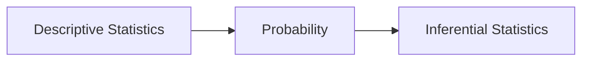

---
tags:
  - university-notes
university-name: Virtual University of Pakistan
date: 2024-11-04
---

# Lecture No. 1

Dated: 04-11-2024

## What is Statistics

It is the science of drawing conclusions from real life data and is a tool for data based research.  
It is also called `quatitative analysis`.  
It has applications in various disciplines such as:

- Agriculture
- Anthropology
- Astronomy
- Biology
- Economic
- Engineering
- Geology
- Genetics
- Medicine
- Physics
- Psychology
- Zoology

## Nature of This Discipline

## Meaning of Statistics

It comes from the `latin` word `status` which means political state.  
It originally meant information useful to the state.

- It refers to "numerical facts systematically arranged". In this case, we always use the plural form of `statistics`. This is what the the word `statistics` normal is referred to but the word `data` is used instead.
- It is a discipline that involves procedures and techniques to collect, process and analyze numerical data to make inferences and research decisions against uncertainty which is incompleteness and instability of available data. In this case, the word is used as singular.
- It can also refer to numerical quantities calculated from sample observations. A single quantity that is collected, is called a `statistic`.

## Characteristics of the Science of Statistics

It deals with

- Behavior of aggregates or large bodies of data of same kind, not isolated figures, ignoring what is happening to the individual or object of that aggregate.
- Variability which obscures the underlying patterns.
- Uncertainties as every process of gathering information involves deficiencies and variations.
- Characteristics of things which can be expressed numerically either by count or measurements.
- Aggregates which are subject to a number of random causes. e.g. the height of a person is subject to his race, age, diet, habits, climate etc.
- Statistical laws are valid for _the average_ or in long run. Therefore, `statistical inference` is therefore made against `uncertainty`.
- If the data collection and processing is not handled properly, the results could be misleading.

## They way in Which Statistics Works

It assists in

- Summarizing the larger set of data in a form that is easily understandable.
- Efficient design of laboratories, field experiments, surveys.
- Effective planning in any field of inquiry.
- Making general conclusions that how much of a certain thing will happen in certain conditions.

## Importance of Statistics in Various Fields

- A modern administrator uses statistical data to provide a factual basis for decision.
- A politician uses `statistics` to support his arguments.
- A businessman, industrial or research worker all use `statistics` in their work.

 > [!quote]-  
 > “a social scientist without an adequate understanding of statistics, is often like the blind man groping in a dark room for a black cat that is not there”

## The Meaning of Data

It comes from the `latin` word `datum`(singular) and `data` means "those which are given".  
`Data` may therefore be thought as the `results of observations`.

## Observations

An `observation` means any sort of numerical recording of information whether it is physical such as measuring `height`, `width`, a `classification` such as `heads` or `tails`, or an answer to a question such as `yes` or `no`.

## Variables

A characteristic which varies with an object or an individual such as `age`.  
The set of all possible values from which a `variable` can take, is called `domain`.  
If the `domain` consists of only one value then the `variable` is called a `constant`.

## Quantitative and Qualitative Variables

### Quantitative

The `variables` which are numerical such as `age`, `height` etc are called `quantitative variables`.

### Qualitative

The `variables` which are not numerical such as `eye color`, `poverty`, `education` etc are called `qualitative variables`.

## Discrete and Continuous Variables

### Discrete

These `variables` take a discrete set of integers or whole numbers, as jumps or breaks.

#### Examples

- Number of rooms in a house
- Number of family members

### Continuous

These `variables` can take any fractional or integer values given within an `interval` without gaps.

#### Examples

- Age
- Height
- Temperature

## Measurement Scales

### Measurement

`Measurement` means assigning a number to observations or objects.

### Scaling

It is the processing of `measuring`.  
Following are the `scales` discussed.

#### Nominal Scale

Classification of observations into mutually exclusive qualitative categories.

##### Examples

- Students in a class are males or females, hence we can assign `1` and `2` respectively.
- Rainfall can be heavy, moderate or light, hence we can assign `1`, `2` and `3` respectively.

#### Ordinal or Ranking Scale

Similar to [nominal scale](#nominal-scale) but with addition of the property of _ordering_ or _ranking_.

##### Examples

- `good`, `fair`, `poor` can be ranked `1`, `2` and `3`.

#### Interval Scale

A [measurement scale](#measurement-scales) possessing a constant interval size but not a true zero point, is called `interval scale`.

##### Examples

- $20^\circ C$ ($68^\circ F$) and $30^\circ C$ ($86^\circ F$)
- $5^\circ C$ ($41^\circ F$) and $15^\circ C$ ($59^\circ F$)

Both of the scales have equal intervals.  
10 units for `celsius` scale and 18 units for `farenheit`.

#### Ratio Scale

Same as [interval scale](#interval-scale) but it has a true meaningful `zero point`.

## Errors of Measurement

The true value can never be measured because of certain habits, practices, methods and instruments used for measurements.  
This departure of recorded value from the true value is called `error of measurement`.

If the observed value is $x$ but the true value is $x + \epsilon$ then the `absolute error` is $(x + \epsilon) - \epsilon$  
The ratio of `absolute error` to `true value` $\frac{(x + \epsilon) - \epsilon}{x + \epsilon}$ is called the `relative error`.  
Multiplying `relative error` by 100 gives us `percentage error`.

### Example

If a student's weight is measured as $60KG$ then we know for certain that his true weight is within $60.5KG$ to $59.5KG$ range.

## Biased and Random Errors

### Biased

An `error` is called _biased_ if the observed value is constantly or consistently higher or lower than the true value.  
This happens due to to limitations of measuring instrument and is cumulative.  
Being cumulative means that the more measurements we do, the `error` adds up and its magnitude in overall result increases.  
They are also called `cumulative` or `systematic errors` and are not revealed by repeating measurements.

### Random or Unbiased

An `error` is said to be _unbiased_ or _random_ when the deviations from the true value, either excesses or defects tend to occur equally often.  
When `measurements` happen often, they tend to cancel out in the long run.  
Therefore, these `errors` are _compensating_ and are also called `accidental errors`.