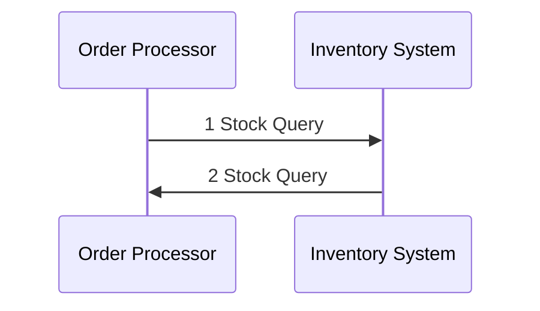

---
tags:
  - university-notes
university-name: Virtual University of Pakistan
date: 2025-03-25
---

# Lecture No. 3

<span style="color: gray;">Dated: 25-03-2025</span>  

The `request-response` looks as follows



## Comparison

`Events`[^1] can be independent of the producer and consumer meanwhile we cannot say for sure about `request response` sequence, which reduces latency.  
`Events`[^1] are one way (push), can have multiple consumers and can work `asynchronously`,[^1] reducing the `coupling`.

## Event Channel

An `event channel` is a subscription mechanism for `events`.[^1]  
It can be an intermediary `XML` file.

## Service Oriented Architecture

`Service-oriented architecture` (SOA) is built from `request-response`.  
It moves away from `monolithic` applications.

## Event Producer

An `event producer` is an entity at the edge of an event processing system that introduces `events`[^1] into the system.

## Event Consumer

An `event consumer` is an entity at the edge of an event processing system that receives `events`[^1] from the system.

## Raw Event

A `raw event` is an `event`[^1] that is introduced into an event processing system by an [event producer](#event-producer).

## Derived Event

A `derived event` is an `event`[^1] that is generated as a result of event processing that takes place inside an event processing system.

## Stateless Event Processing

An event processing agent is said to be stateless if the way it processes one `event`[^1] does not influence the way it processes any subsequent `events`.[^1]

## Event Stream

An event stream is a `set`[^2] of associated `events`,[^1] which is often ordered.

### Homogeneous

A `stream` in which all the `events`[^1] must be of the same type is called a `homogeneous event stream`.

### Heterogeneous

A `stream` in which the `events`[^1] may be of different types is referred to as a `heterogeneous event stream`.

## Types of Agents

- Filter
- Transformation
	- Translate
		- Enrich
		- Project
	- Aggregate
	- Split
	- Compose
- Pattern detect

```cpp
#include <iostream>
#include <fstream>
#include <conio.h>

int fileChanged = 0;
char lastChar = '-';

int onKeyPress() {
    char b = std::cin.get();
    std::cout << b << std::endl;
    return b == 'x';
}

int onFileRead(char a) {
    if (a != lastChar) {
        fileChanged = 1;
        lastChar = a;
    }
    return 0;
}

int onFileChanged() {
    std::cout << lastChar << std::endl;
    return lastChar == 'x';
}

int main() {
    do {
        if (_kbhit()) {
            if (onKeyPress())
                return 0;
        }

        std::ifstream f("test.txt", std::ifstream::in);
        if (f.good()) {
            if (onFileRead(f.get()))
                return 0;
        }
        f.close();

        if (fileChanged) {
            if (onFileChanged())
                return 0;
        }

    } while (true);

    return 0;
}
```

## References

[^1]: Read more about [[cs411_02|events]].
[^2]: Read more about [[M_Set|sets]].